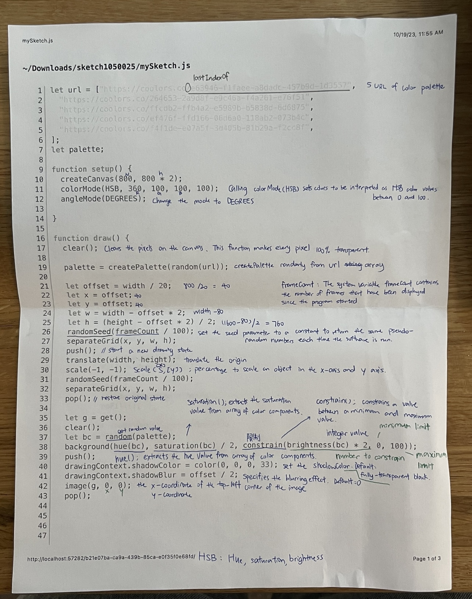
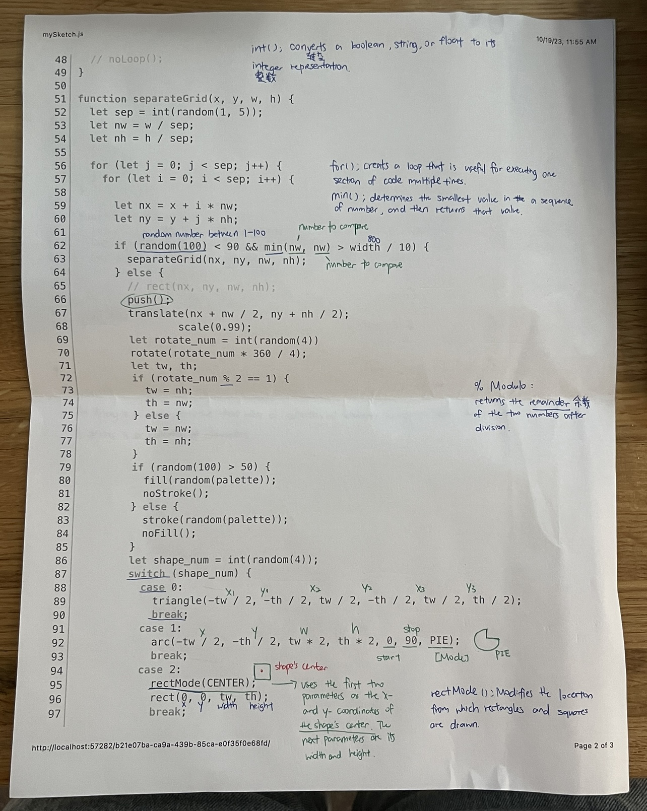
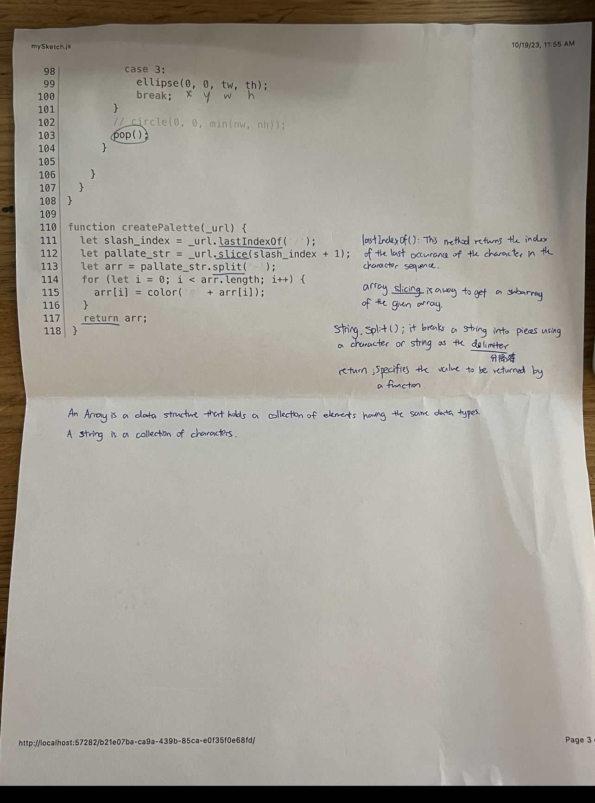

# 04-pixels
I chose Takawo's p5 sketch for this assignment.

I am interested in how Takawo's sketches can be different each time I refreshed it, and how multiple sketches can be fit into one page.

I referenced p5 reference page and also some other online information to finish the annotations.

One thing that I think is very smart is that Takawo uses external color palette so that he doesn't need to deal with color for each element, which is very convenient.

 
 
 

The link to Takawo's sketch: 
https://openprocessing.org/sketch/1050025
[Takawo's sketch](https://www.youtube.com/watch?v=zrwUIS7rj54](https://openprocessing.org/sketch/1050025)

Example:
[Parametric_equation](https://www.youtube.com/watch?v=zrwUIS7rj54](https://en.wikipedia.org/wiki/Parametric_equation#:~:text=Parametric%20equations%20are%20commonly%20used,as%20parametrisation)%20of%20the%20object)
